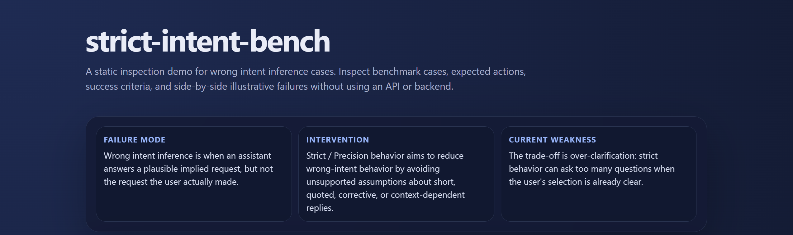
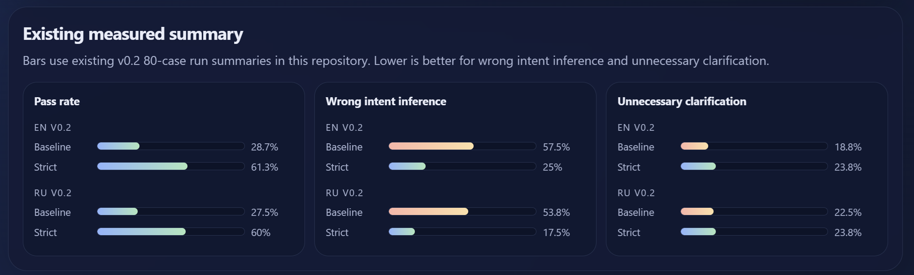

# strict-intent-bench

`strict-intent-bench` is a benchmark-first repository for **wrong intent inference** in conversational AI assistants.

Wrong intent inference is a failure mode where the assistant answers a plausible but unstated question. The response may be fluent and locally reasonable, but it is grounded in the wrong interpretation of the user's intent.

**Live demo:** https://pneqnp-iswr.github.io/strict-intent-bench/



This repository presents:

- a public benchmark for that failure class;
- a reproducible evaluation runner;
- a static inspection demo with side-by-side examples;
- published English and Russian result tracks;
- Strict / Precision prompt variants as tested interventions, not the whole project.

## Current result

The current English v0.8 champion is **Strict / Precision v13**:

```text
baselines/strict_v13_unseen_pending/strict.txt
```

On the English v0.3 development set of 80 cases, Strict / Precision v13 improved action accuracy from **38.8%** to **66.2%** and reduced wrong intent inference from **37.5%** to **5.0%**.

| Metric | Baseline | Strict v13 | Delta |
|---|---:|---:|---:|
| Action accuracy ↑ | 38.8% | **66.2%** | +27.4 |
| Wrong intent inference ↓ | 37.5% | **5.0%** | -32.5 |
| Metadata unnecessary clarification ↓ | 15.0% | **11.2%** | -3.8 |
| Metadata needed clarification missing ↓ | 30.0% | **15.0%** | -15.0 |
| Overclarification on clear direct ↓ | 35.0% | **25.0%** | -10.0 |
| Overclarification on strong pending context ↓ | 36.4% | **24.2%** | -12.2 |
| Underclarification on high-ambiguity short fragments ↓ | 60.0% | **0.0%** | -60.0 |

This is a measured improvement, not a final solution. v13 did not reach the stronger 75% full-set action-accuracy target, and later v15 experiments remained unstable across mini-checks.



## v0.8 decision

For v0.8 English reporting:

- public champion: `baselines/strict_v13_unseen_pending/strict.txt`
- experimental branch: `baselines/strict_v15_metadata_grounded/strict.txt`
- rejected branch: `baselines/strict_v14_full80_failurefix/strict.txt`

Supporting reports:

- [v0.8 English result summary](reports/v0.8/v0.8_en_result_summary.md)
- [Full EN 80 v13 trade-off report](reports/v0.8/dev_en_full_80_v13_unseen_pending_tradeoff.md)
- [v15 balanced-16 check](reports/v0.8/dev_en_balanced_16_v15_metadata_grounded_tradeoff.md)
- [v15 unseen-balanced-16 check](reports/v0.8/dev_en_unseen_balanced_16_v15_metadata_grounded_tradeoff.md)
- [v15 stronger-grader regrade on v13 failures](reports/v0.8/dev_en_v13_failures_21_v15_regrade_g54_tradeoff.md)

A careful public claim is:

```text
On the English v0.3 development set of 80 cases, Strict / Precision v13 improved action accuracy from 38.8% to 66.2% and reduced wrong intent inference from 37.5% to 5.0%.
```

Do not read this as a claim that strict prompting is universally better or that wrong intent inference is solved.

## Documentation

Core project docs:

- [Public summary](reports/v0.6/public_summary.md)
- [Dataset card](docs/dataset_card.md)
- [Error taxonomy](docs/error_taxonomy.md)
- [Annotation guidelines](docs/annotation_guidelines.md)
- [Case quality checklist](docs/case_quality_checklist.md)
- [Manual audit protocol](benchmark/manual/audit_protocol_v0.6.md)
- [No-API reproduction guide](benchmark/manual/no_api_reproduction.md)
- [Roadmap](ROADMAP.md)
- [Contributing](CONTRIBUTING.md)
- [v0.6 release notes](docs/release_notes_v0.6.md)

## Tooling

No-API development and inspection tools:

- `tools/validate_dataset.py` checks JSONL validity and v0.3 schema fields.
- `tools/audit_dataset_quality.py` flags weak metadata, duplicate cases, broad acceptable actions, and suspicious action/context combinations.
- `tools/compare_dataset_splits.py` compares structural balance across two JSONL splits.
- `tools/export_demo_cases.py` rebuilds the static demo data.
- `tools/make_manual_eval_sheet.py`, `tools/score_manual_eval.py`, and `tools/heuristic_grade_manual_eval.py` support manual/no-API evaluation workflows.
- `tools/build_prompt_synthesis_pack.py` builds evidence packs for prompt-design audits.
- `tools/export_case_failures.py` joins graded failures with dataset metadata for forensic analysis.
- `tools/regrade_case_results.py` regrades existing outputs with a stronger grader without regenerating candidate answers.

## Repository structure

```text
strict-intent-bench/
├─ benchmark/
│  ├─ data/
│  ├─ prompts/
│  ├─ manual/
│  └─ README.md
├─ baselines/
│  ├─ no_prompt/
│  ├─ strict_v8/
│  ├─ strict_v13_unseen_pending/
│  └─ strict_v15_metadata_grounded/
├─ docs/
│  ├─ demo.html
│  ├─ dataset_card.md
│  ├─ error_taxonomy.md
│  └─ annotation_guidelines.md
├─ reports/
├─ results/
├─ tools/
├─ ROADMAP.md
├─ CONTRIBUTING.md
├─ README.md
├─ report.md
├─ requirements.txt
├─ run_eval.py
├─ LICENSE
├─ .gitignore
└─ .gitattributes
```

## What is benchmarked

The benchmark covers four conversational categories:

- `quoted_reply`
- `short_fragment`
- `acknowledgment_or_correction`
- `clear_direct`

The main remaining weak spots are `short_fragment`, `ask_clarification`, and `continue_pending_task` boundary cases.

## Earlier holdout-v2 result

The strongest earlier holdout-v2 result used `Strict / Precision v8` on RU/EN 40-case splits.

| Split | Method | Pass rate ↑ | Wrong intent inference ↓ | Unnecessary clarification ↓ |
|---|---:|---:|---:|---:|
| RU holdout v2 | No prompt baseline | 35.0% | 42.5% | 15.0% |
| RU holdout v2 | Strict / Precision v8 | **77.5%** | **10.0%** | **12.5%** |
| EN holdout v2 | No prompt baseline | 47.5% | 32.5% | **10.0%** |
| EN holdout v2 | Strict / Precision v8 | **72.5%** | **22.5%** | **10.0%** |

The earlier result showed that `Strict / Precision v8` improved pass rate and reduced wrong intent inference on both RU and EN holdout splits, while keeping unnecessary clarification low.

## Tested interventions

Current and historical interventions include:

- `baselines/strict_v13_unseen_pending/strict.txt` — current v0.8 English champion.
- `baselines/strict_v15_metadata_grounded/strict.txt` — experimental branch, not selected as v0.8 champion.
- `baselines/strict_v8/strict.txt` — earlier holdout-v2 intervention.

The baseline comparison is:

- `baselines/no_prompt/baseline.txt`

`baseline.txt` is intentionally empty. It represents the same model with no added behavior layer.

## Main published result

Primary earlier published runs:

- English mirror: `results/holdout-v2-v8-40/en/`
- Russian source track: `results/holdout-v2-v8-40/ru/`

### English holdout-v2, v8

| Metric | Baseline | Strict v8 |
|---|---:|---:|
| Pass rate | 47.5% | 72.5% |
| Wrong intent inference rate | 32.5% | 22.5% |
| Unnecessary clarification rate | 10.0% | 10.0% |
| Clarification rate | 22.5% | 37.5% |

### Russian holdout-v2, v8

| Metric | Baseline | Strict v8 |
|---|---:|---:|
| Pass rate | 35.0% | 77.5% |
| Wrong intent inference rate | 42.5% | 10.0% |
| Unnecessary clarification rate | 15.0% | 12.5% |
| Clarification rate | 25.0% | 45.0% |

## Cross-language comparison

The repository keeps two aligned tracks:

- **Russian source track**: original authored datasets and result runs.
- **English mirror track**: translated mirror datasets and result runs for an English-speaking audience.

The English mirror is useful for communication and cross-language sanity checking, but it is not a fully independent benchmark from the Russian source track.

### v8 comparison on holdout-v2

| Language | Baseline pass | Strict pass | Pass delta | Baseline wrong intent | Strict wrong intent | Wrong-intent delta |
|---|---:|---:|---:|---:|---:|---:|
| English | 47.5% | 72.5% | +25.0 | 32.5% | 22.5% | -10.0 |
| Russian | 35.0% | 77.5% | +42.5 | 42.5% | 10.0% | -32.5 |

### Category breakdown on holdout-v2, v8

| Category | EN baseline | EN strict | RU baseline | RU strict |
|---|---:|---:|---:|---:|
| `quoted_reply` | 20.0% | 80.0% | 10.0% | 100.0% |
| `short_fragment` | 30.0% | 40.0% | 10.0% | 50.0% |
| `acknowledgment_or_correction` | 60.0% | 90.0% | 60.0% | 90.0% |
| `clear_direct` | 80.0% | 80.0% | 60.0% | 70.0% |

## Earlier supporting result

Earlier holdout runs are also preserved:

- English: `results/holdout-v1-v7-40/en/`
- Russian: `results/holdout-v1-v7-40/ru/`

| Language | Baseline pass | Strict pass | Baseline wrong intent | Strict wrong intent |
|---|---:|---:|---:|---:|
| English v7 | 25.0% | 55.0% | 45.0% | 20.0% |
| Russian v7 | 25.0% | 67.5% | 50.0% | 12.5% |

## Interpretation

The strongest benchmark-supported claim is narrow and practical:

**assistant behavior can be made measurably better on wrong-intent-inference cases through a stricter action-selection policy, especially for quoted replies, corrections, short fragments, and context-sensitive follow-ups.**

This repository does **not** support a broad claim that strict prompting is universally better for all conversations.

## Reproducing the evaluation

Install dependencies:

```bash
pip install -r requirements.txt
```

Run the current English v0.8 evaluation:

```bash
python run_eval.py --dataset benchmark/data/v0.3/dev_en_v3.jsonl --strict-prompt baselines/strict_v13_unseen_pending/strict.txt --output-dir results/v0.8-dev-en-full-80-v13-unseen-pending
```

Analyze the v0.8 clarification trade-off:

```bash
python tools/analyze_clarification_tradeoff.py --case-results results/v0.8-dev-en-full-80-v13-unseen-pending/case_results.csv --dataset benchmark/data/v0.3/dev_en_v3.jsonl --output-md reports/v0.8/dev_en_full_80_v13_unseen_pending_tradeoff.md --output-json reports/v0.8/dev_en_full_80_v13_unseen_pending_tradeoff.json
```

Run the earlier English mirror evaluation:

```bash
python run_eval.py --dataset benchmark/data/holdout_cases_en_v2.jsonl --output-dir results/holdout-en-v2-v8-40
```

Run the earlier Russian source-track evaluation:

```bash
python run_eval.py --dataset benchmark/data/holdout_cases_ru_v2.jsonl --output-dir results/holdout-ru-v2-v8-40
```

Default paths:

- dataset: `benchmark/data/seed_cases.jsonl`
- grader: `benchmark/prompts/grader.txt`
- baseline prompt: `baselines/no_prompt/baseline.txt`
- strict prompt: `baselines/strict_v8/strict.txt`

## No-API inspection

The benchmark can be inspected without API access:

- open the [live demo](https://pneqnp-iswr.github.io/strict-intent-bench/);
- read the [dataset card](docs/dataset_card.md);
- validate local JSONL files;
- use the [manual audit protocol](benchmark/manual/audit_protocol_v0.6.md);
- follow the [no-API reproduction guide](benchmark/manual/no_api_reproduction.md).

No-API inspection does not replace measured model evaluation, but it makes the artifact reviewable without private runs.

## Dataset quality tooling

Run structural validation:

```bash
python tools/validate_dataset.py benchmark/data/v0.3/dev_en_v3.jsonl --require-v03
python tools/validate_dataset.py benchmark/data/v0.3/dev_ru_v3.jsonl --require-v03
```

Run dataset quality audit:

```bash
python tools/audit_dataset_quality.py benchmark/data/v0.3/dev_en_v3.jsonl --output reports/v0.7/dev_en_v3_quality.md
python tools/audit_dataset_quality.py benchmark/data/v0.3/dev_ru_v3.jsonl --output reports/v0.7/dev_ru_v3_quality.md
```

Compare EN/RU structural balance:

```bash
python tools/compare_dataset_splits.py benchmark/data/v0.3/dev_en_v3.jsonl benchmark/data/v0.3/dev_ru_v3.jsonl --output reports/v0.7/en_ru_v3_split_comparison.md
```

## Limitations

- small datasets;
- automated grading;
- prompt-layer intervention, not model training;
- exact results may vary across model versions and sampling behavior;
- the English sets are translated mirrors of the Russian source, not independently authored benchmarks;
- cross-language comparisons are informative, but not perfectly apples-to-apples;
- token usage in this prototype is inflated by the explicit behavior prompt and should not be treated as a product-ready cost estimate;
- v13 has not yet reached the stronger 75% full-set action-accuracy target;
- `short_fragment`, `ask_clarification`, and `continue_pending_task` boundary cases remain the main weak spots.

## Discussion

OpenAI Community discussion: [Click here](https://community.openai.com/t/wrong-intent-inference-is-measurable-benchmark-strict-precision-mode-proposal/1380779)

## License

MIT
